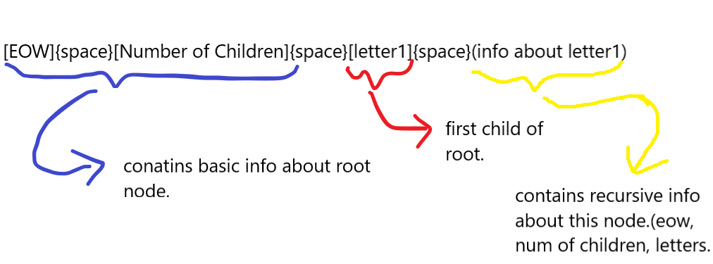

# ReadMe.md

This repo contains implementation of Auto Complete feature using Trie.The Trie is serialised and stored in a txt file called myTrie.txt.The myTrie.txt, if found is deserialised into a trie upon initialisation else only the root is initialised.We can also load words from a word file.Different words file like words.txt and words2.txt are there to test it.
You can also visualise the trie on the terminal.

Also the format used while serialising and deserialising is as follows:

```
[EOW]{space}[Number of Children]{space}[letter1]{space}(info about letter1)[letter2]{space}(info about letter2).....
```



## Usage

>clone the repo and move into it.
>for Windows, change encoding of terminal by :chcp 65001 to support utf-8 characters. No need to do it in linux.
>run main.cpp by :
>g++ main.cpp -o main,
>then simply run main

## Screenshots


